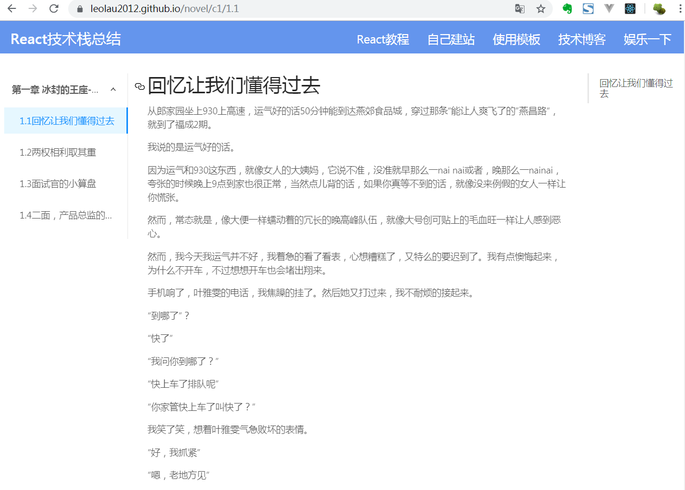

# Gatsby技术博客源码

### 演示地址：<https://leolau2012.github.io/>

### 效果截图：



## 特征
* 响应式
* 基于
* 使用**gatsby+antdesign+markdown**构建
* 适合写技术博客和技术文档用

## 上手

1.  **克隆这个库**

    Use the Gatsby CLI to create a new site, specifying the default starter.

    ```sh
    git clone https://github.com/leolau2012/gatsby-teach.git
    ```
1.  **安装依赖.**

    Navigate into your new site’s directory and start it up.

    ```sh
    yarn
    ```
    
1.  **运行**

    打开浏览器，输入 `http://localhost:8000`!
    
    数据地址：http://localhost:8000/___graphql
