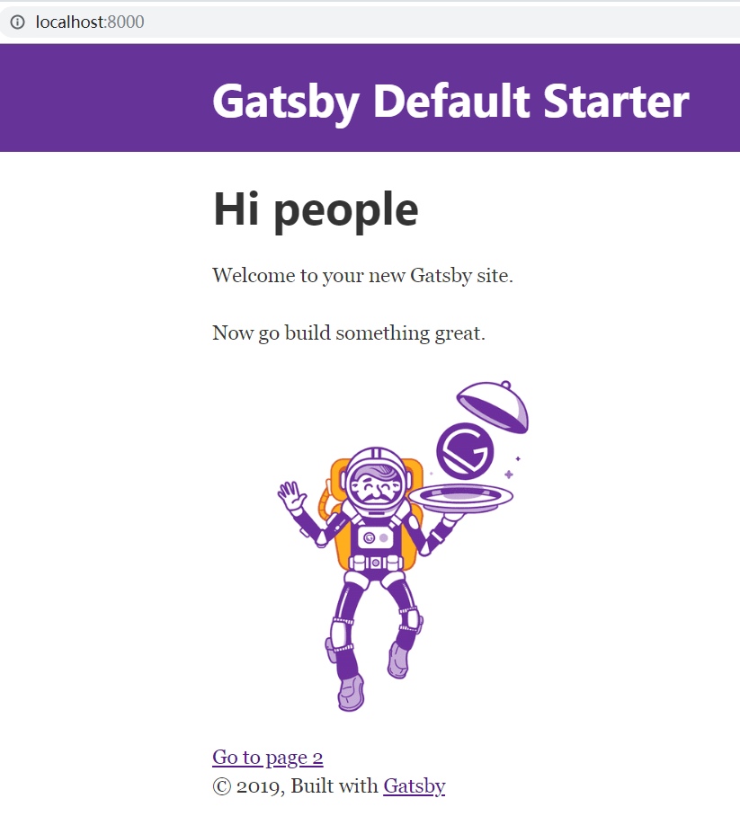
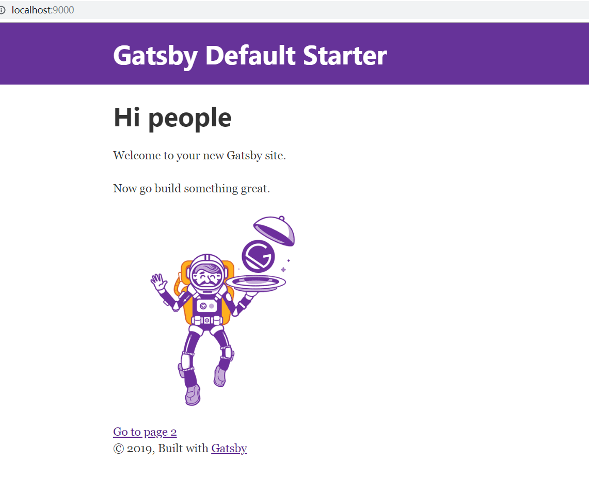

## 1.1Gatsby安装和博客搭建

### 1.安装

```node
yarn global add gatsby-cli
```

### 2.创建gatsby项目

```js
gatsby new blog
```

### 3.开发

```
gatsby develop
```

注意报错：

```
error UNHANDLED EXCEPTION
Error: no parsers registered for: "\"
```

文件空格问题，最好不要用空格和中文。直接放在硬盘根目录下就不会有问题。

打开<http://localhost:8000/>，看到如下效果就成功了：



### 4.构建

```js
gatsby build
```

5.查看效果

```
gatsby serve
```
打开浏览器：http://localhost:9000/看到如下效果


大功告成！