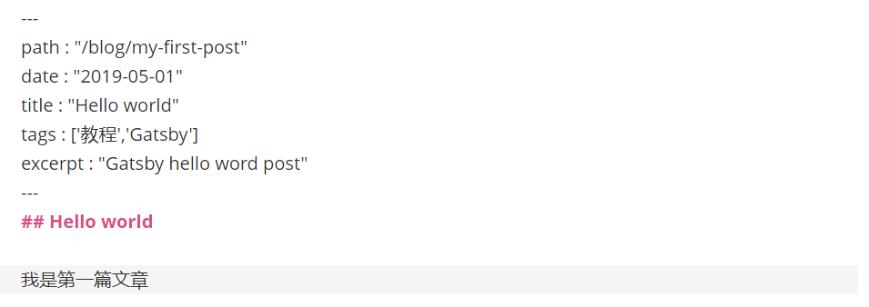

## 1.2Gatsby支持Markdown

### 1.安装插件

我用Gatsby就是因为它支持Markdown.所以不墨迹，直接整Md支持。

```js
yarn add gatsby-source-filesystem
yarn add gatsby-transformer-remark
```

### 2.添加格式化文章

在src>pages下面,添加三篇文章，头部格式如下：

>
>path : "/blog/my-first-post"
>date : "2019-05-01"
>title : "Hello world"
>tags : ['教程','Gatsby']
>
>excerpt : "Gatsby hello word post"

完整代码如图所示：



