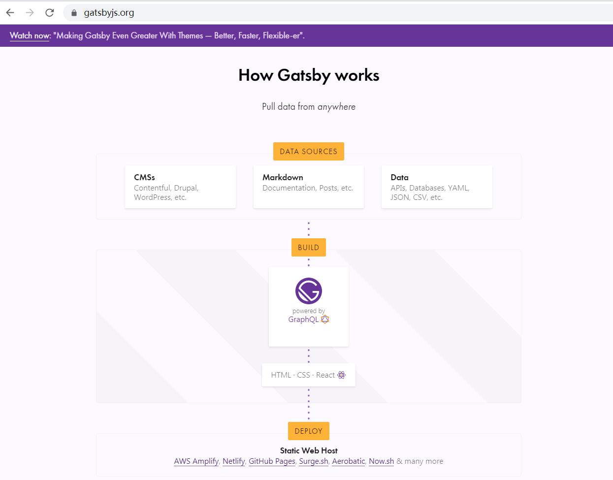
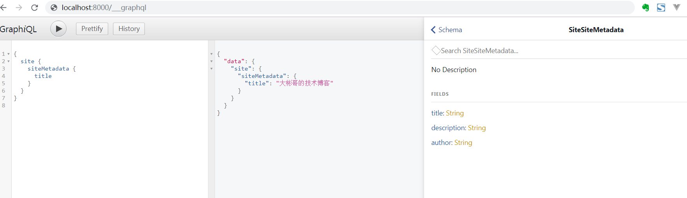

## 1.3使用GraphQL解析Markdown

### 1.什么是GraphQL

> GraphQL 既是一种用于 API 的查询语言也是一个满足你数据查询的运行时。 GraphQL 对你的 API 中的数据提供了一套易于理解的完整描述，使得客户端能够准确地获得它需要的数据，而且没有任何冗余，也让 API 更容易地随着时间推移而演进，还能用于构建强大的开发者工具。

官网：<http://graphql.cn/>

### 2.为什么需要它？

一图抵万言：



### 3.怎么做？

#### 	1.一图抵万言，



解释：你需要的东西都在这段代码里：

```
{
  site {
    siteMetadata {
      title
    }
  }
}
```

#### 2.怎么套到组件里？

src>components>Header.js里面，

```
import { StaticQuery, graphql } from 'gatsby'
import React from "react"
const TitleAndDescription = ({ data }) => {
//这里的数据是下面查出来的
  const title = data.site.siteMetadata.title;
  const description = data.site.siteMetadata.description;
  return (
    <div style={{
      display: 'flex',
      flexDirection: 'column',
      alignItems: 'center'
    }}>
      <h2>{title}</h2>
      <p>{description}</p>
    </div>
  );
}
//这里是所有数据，传到了TitleAndDescription组件里，react组件数据传递
const Header = () => {
  return (
    <StaticQuery
      query={graphql`
        query{
          site {
            siteMetadata {
              title,
              description,
              
            }
          }
        }
      `}
      render={data => <TitleAndDescription data={data} />}
    />
  )
}
export default Header

```

这里是所有数据，传到了TitleAndDescription组件里，react组件数据传递,我这么就为了看着舒服一点。

#### 3.嵌套Header

将Header组件扔到 pages下面的index.js里面：

```
import React from "react"
import Header from '../components/header'
const Layout = () => {
  return (
    <div>
      <Header />
    </div>
  )
}
export default Layout;
```

打开首页，看到网站的描述就大功告成了。


